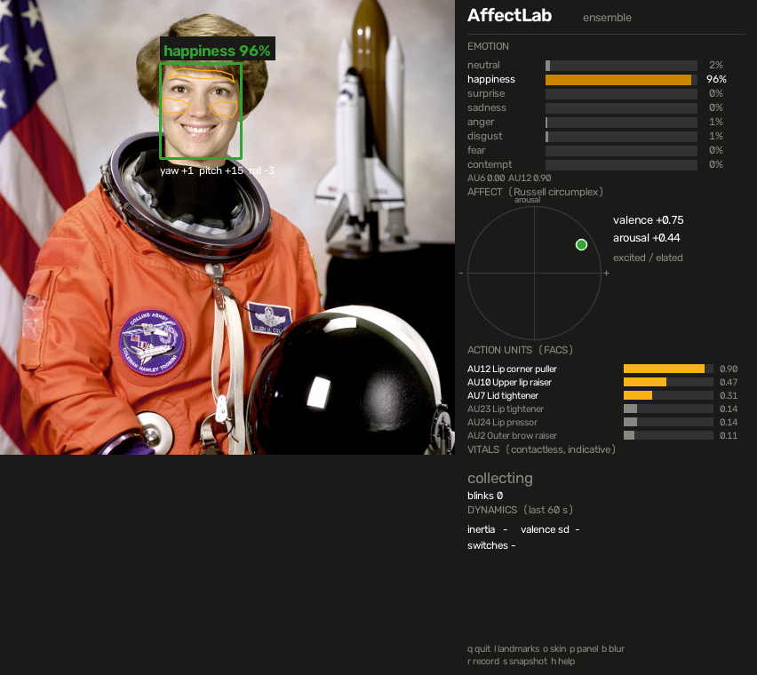
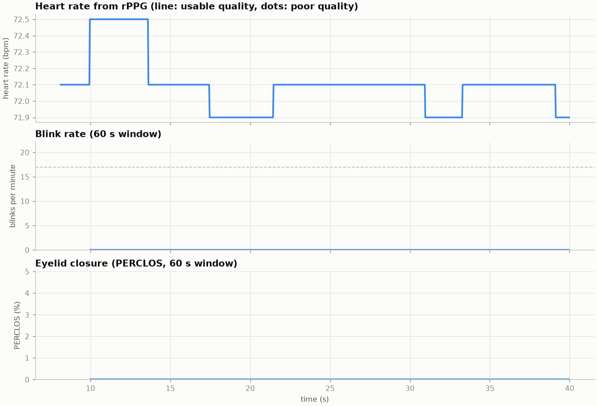
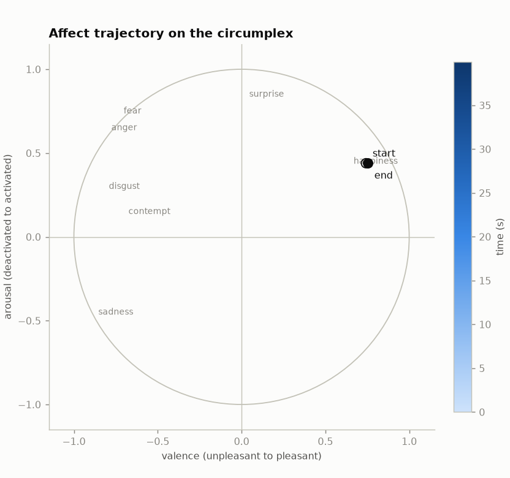
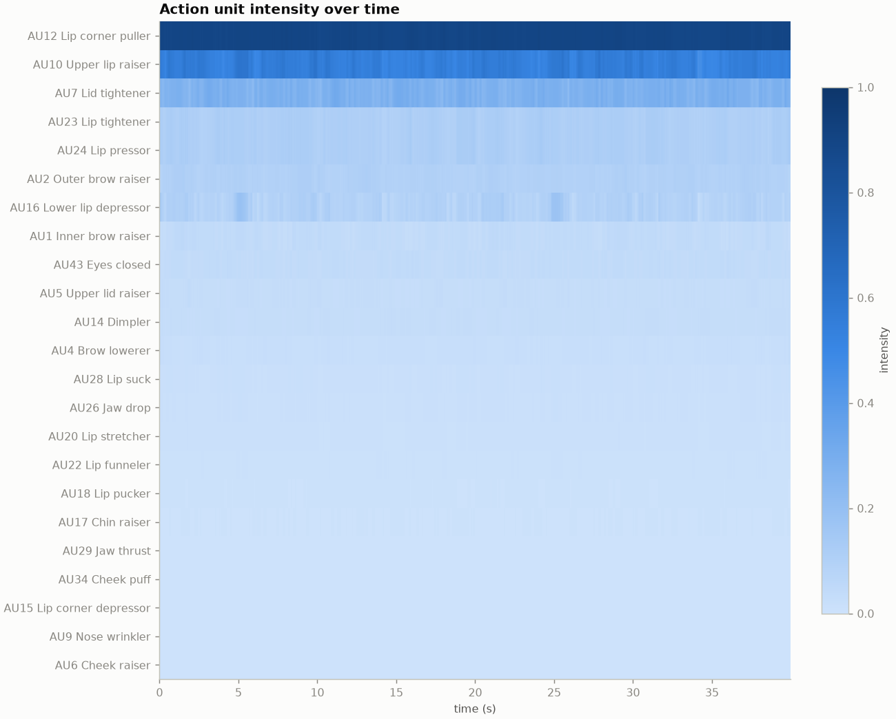
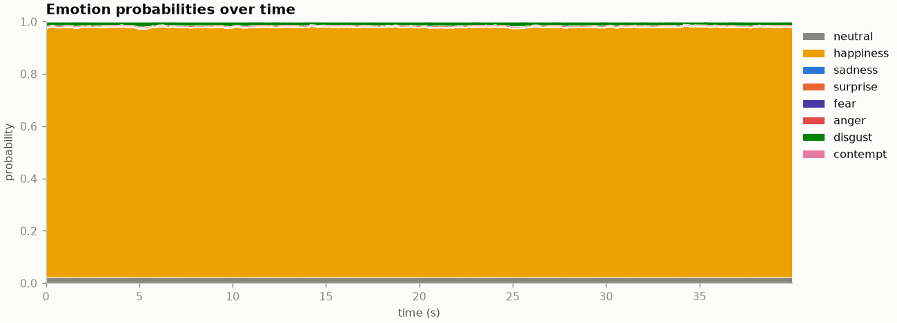

# AffectLab

**A real-time affective computing laboratory for an ordinary webcam.**
Facial Action Units, explainable emotion estimates, dimensional affect on
Russell's circumplex, contactless heart rate, blink dynamics and head pose,
all from one camera, all on your own machine.

[](https://github.com/Juuzoe/PythonEmotionDetecter/actions/workflows/ci.yml)

[](LICENSE)



*A single image through `affectlab image tests/data/astronaut.png --save demo.png --rois`.
The orange outlines are the forehead and cheek regions used for heart rate; on a
live stream the vitals, action-unit and dynamics sections fill in.*

## Why this is not another emotion detector

Most webcam "emotion detectors" print one word above a face. The largest
review of the evidence concludes that facial movements are neither a
reliable nor a specific readout of emotion (Barrett et al., 2019). AffectLab
takes that seriously and measures several layers, keeping them apart so each
can be judged on its own merits:

| Layer | What is measured | Method |
|---|---|---|
| **Facial Action Units** | 23 FACS action units, such as AU12 lip corner puller or AU4 brow lowerer | MediaPipe blendshapes mapped through a documented table |
| **Categorical emotion** | Probabilities over eight labels, with the evidence behind each rule-based decision | Explainable EMFACS-style rules, the FER+ network, DeepFace, or an ensemble |
| **Dimensional affect** | Valence and arousal on Russell's circumplex, smoothed and tracked | Probability-weighted circumplex coordinates |
| **Emotion dynamics** | Emotional inertia, variability, switch rate, time in state | Statistics from affective science over a rolling window |
| **Heart rate** | Beats per minute with a signal-quality grade, plus experimental RMSSD | Remote photoplethysmography (POS, CHROM or GREEN) |
| **Alertness and breathing** | Blink rate, PERCLOS eyelid closure, experimental breathing rate | Eye aspect ratio, eyelid closure, head motion |
| **Head pose** | Yaw, pitch, roll | MediaPipe transform, PnP fallback |

Everything runs locally. The only network traffic is a one-time,
checksum-verified download of three small model files.

The methods and their sources are written up in
[docs/SCIENCE.md](docs/SCIENCE.md). What the numbers do and do not mean,
and where the law forbids using them, is in [docs/ETHICS.md](docs/ETHICS.md).
Please read it before pointing the camera at anyone but yourself.

## Quick start

```bash
git clone https://github.com/Juuzoe/PythonEmotionDetecter.git
cd PythonEmotionDetecter
python -m venv .venv && source .venv/bin/activate      # Windows: .venv\Scripts\activate
pip install -e .
affectlab models download        # about 40 MB, verified by SHA-256
affectlab live --mirror
```

Press `q` to quit. Give the heart-rate estimate about ten seconds of a still,
evenly lit face; the panel shows how many seconds of signal it has.

On Debian or Ubuntu, MediaPipe needs a few system libraries:

```bash
sudo apt install libegl1 libgles2 libgl1 libglib2.0-0
```

`affectlab doctor` checks the installation, the models and, with
`--camera 0`, the webcam.

## What you see

The side panel has five sections:

* **Emotion**: probability bars for the eight labels; the dominant one is
  coloured. For rule-based estimates the action units behind the decision
  are listed underneath.
* **Affect**: the current valence/arousal point on the circumplex with a
  fading trajectory, and the quadrant in words.
* **Action units**: the six strongest FACS action units right now.
* **Vitals**: heart rate with quality (good, fair, poor) and signal-to-noise
  ratio, the pulse waveform, blink rate, PERCLOS, RMSSD and breathing rate.
  Everything here is indicative, not clinical.
* **Dynamics**: emotional inertia, valence variability and label switches
  over the last minute.

Keys while a window is open:

| key | action | key | action |
|---|---|---|---|
| `q` | quit | `l` | toggle landmarks |
| `o` | toggle the rPPG skin regions | `p` | toggle the side panel |
| `b` | pixelate the face (privacy) | `r` | start or stop recording a session |
| `s` | save a snapshot | `h` | toggle the key help |

## Commands

```text
affectlab live    [--camera 0] [--mirror] [--backend ensemble] [--record session.csv]
                  [--output annotated.mp4] [--rppg pos|chrom|green] [--blur] [--no-hud]
affectlab video   clip.mp4 [--show] [--record clip.csv] [--output annotated.mp4]
affectlab image   photo.jpg [--save annotated.png] [--json]
affectlab report  session.csv [--out report_dir] [--no-figures]
affectlab doctor  [--camera 0]
affectlab models  [list | download | path] [name ...]
```

Every analysis command accepts `--backend`, `--every N` (frames between
emotion inferences), `--rppg`, `--rppg-window SECONDS`, `--no-landmarks`
(YuNet boxes only) and `--no-breathing`. Run any command with `--help` for
the full list. `python main.py` still works and launches `affectlab live`.

### Recording and reports

`--record` writes one row per frame with a fixed schema: timestamps, face
box, head pose, all eight emotion probabilities, valence and arousal,
dynamics, vitals and every action unit. `affectlab report` turns a session
into a Markdown summary, a JSON file and four figures (needs
`pip install "affectlab[report]"`).

<p>


</p>
<p>


</p>

*Figures from the integration-test clip: the portrait above, gently bobbing
at 15 breaths per minute with its green channel pulsing at 72 beats per
minute through video compression. The report recovers 72.1 bpm and 14.9
breaths per minute; the expression, of course, never changes.*

## Emotion backends

| backend | what it is | learned? | explainable? | speed |
|---|---|---|---|---|
| `facs` | EMFACS-style rules over action units | no | yes, lists the AUs | instant |
| `ferplus` | FER+ CNN (Barsoum et al., 2016) via ONNX Runtime | yes | no | 2 to 4 ms |
| `deepface` | the original project's DeepFace pipeline (`pip install "affectlab[deepface]"`) | yes | no | about 100 ms |
| `ensemble` | 0.6 `ferplus` + 0.4 `facs` (default) | both | partly | 2 to 4 ms |

The network reacts to texture and lighting; the rules react to geometry.
Averaging them reduces flicker and keeps the AU evidence attached to every
estimate.

## Using it from Python

```python
import cv2
from affectlab.pipeline import AffectPipeline, PipelineConfig

frame = cv2.imread("tests/data/astronaut.png")
with AffectPipeline(PipelineConfig(backend="ensemble"), video=False) as pipeline:
    result = pipeline.process(frame, timestamp=0.0)

print(result.emotion.dominant, result.emotion.confidence)   # happiness 0.96
print(result.action_units["AU12"])                          # 0.90
print(result.affect.valence, result.affect.arousal)         # 0.75 0.44
print(result.head_pose)                                     # HeadPose(yaw=0.6, pitch=14.9, roll=-3.5)
```

For a stream, call `process` once per frame with increasing timestamps in
seconds; `result.vitals` fills in as signal accumulates. The pipeline does
no I/O of its own, so it runs the same way in a notebook, a test or a
service. See [docs/ARCHITECTURE.md](docs/ARCHITECTURE.md) for the module
map and extension points.

## Accuracy and limits

* rPPG needs a still face and steady light. Large head motion resets the
  buffer on purpose. Published methods, including these, perform worse on
  darker skin tones (Nowara et al., 2020). Compare with a pulse oximeter
  before trusting a reading.
* RMSSD and breathing rate are marked experimental: a 30 fps camera cannot
  time heartbeats precisely, and a 30 s window resolves breathing coarsely.
* Action units come from avatar-oriented blendshapes, not certified FACS
  coding. They are consistent and repeatable, not calibrated.
* Emotion labels describe what an algorithm saw in facial movement. They are
  not what the person feels, and they are unreliable across people, cultures
  and contexts.
* Since 2 February 2025 the EU AI Act prohibits inferring emotions from
  biometric data in workplaces and education institutions. Do not use this
  there. See [docs/ETHICS.md](docs/ETHICS.md).

## Troubleshooting

* **`libEGL.so.1` or `libGLESv2.so.2` not found** (Linux): install
  `libegl1 libgles2 libgl1`. Without them AffectLab falls back to YuNet
  boxes and loses action units, blinks and head pose.
* **No window appears / `cv2.imshow` errors**: you have `opencv-python-headless`
  installed. Use `pip install opencv-python`, or run with `--no-hud --record`.
* **Camera will not open**: try another index (`--camera 1`), close other
  apps using it, and on macOS grant the terminal camera permission.
* **Heart rate stays on "collecting"**: it needs eight seconds of continuous
  signal without large motion. Hold still and check the lighting.
* **Slow**: use `--backend facs` (no network inference) or `--every 4`.

## Development

```bash
pip install -e ".[dev]"
make lint typecheck test      # ruff, mypy, unit tests (no models needed)
make test-all                 # plus integration tests (run affectlab models download first)
```

See [CONTRIBUTING.md](CONTRIBUTING.md) and [CHANGELOG.md](CHANGELOG.md).

## History

This project started in February 2025 as PythonEmotionDetecter, a single
script that drew a DeepFace emotion label on a webcam feed
([demo video](https://youtu.be/LmL2S5u2oRg)). Version 2 keeps that
backend available and rebuilds everything around it.

## Citing

If AffectLab helps your project or coursework, cite the repository and the
original methods it implements, listed in
[docs/SCIENCE.md](docs/SCIENCE.md#references). The test portrait is a NASA
photograph of astronaut Eileen Collins, in the public domain.

## License

MIT. See [LICENSE](LICENSE). Model files are downloaded separately under
their own licences (MediaPipe Face Landmarker, Apache-2.0; FER+ from the
ONNX Model Zoo, MIT; YuNet from the OpenCV Zoo, MIT).
