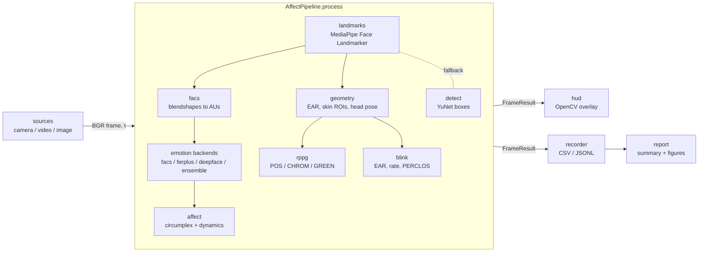

# Architecture

AffectLab is a small pipeline with strict boundaries. Two rules shape it:

1. **The pipeline does no I/O.** `AffectPipeline.process(frame, timestamp)`
   takes a BGR array and returns a `FrameResult`. Cameras, files, windows,
   CSV writers and network downloads live in separate modules. The same
   pipeline therefore runs on a webcam, a video file, a single image and a
   unit test with synthetic frames.
2. **Every stage is small and testable on its own.** Signal processing
   (`rppg`, `blink`, `affect`, `facs`, `geometry`) is pure functions plus a
   few tiny stateful trackers, tested against synthetic signals with known
   answers. The heavy dependencies (MediaPipe, ONNX Runtime, DeepFace) sit
   behind thin wrappers and are imported lazily.

## Data flow

## Module map

| Module | Responsibility | Depends on |
|---|---|---|
| `types` | Dataclasses shared by everything: `BBox`, `FaceObservation`, `EmotionEstimate`, `Affect`, `Vitals`, `Dynamics`, `FrameResult` | numpy |
| `models` | Registry of downloadable models with URL, licence, size and SHA-256; cache directory; verified download | stdlib |
| `landmarks` | MediaPipe Face Landmarker wrapper producing `FaceObservation` (478 landmarks, 52 blendshapes, 4x4 transform) | mediapipe, cv2 |
| `detect` | YuNet box detector used when MediaPipe is unavailable | cv2 |
| `geometry` | Landmark index constants, eye aspect ratio, skin polygons, mean colour, head pose (transform or PnP), motion metric | cv2, numpy |
| `facs` | Blendshape to Action Unit table, EMFACS-style prototypes, explainable rule-based emotion | types |
| `emotion/` | `EmotionBackend` protocol and the `facs`, `ferplus`, `deepface` and `ensemble` implementations | onnxruntime (lazy), deepface (lazy) |
| `affect` | Circumplex coordinates, expected valence/arousal, exponential smoother, `AffectTracker` with inertia, variability and switch rate | numpy |
| `rppg` | Rolling RGB buffer, POS/CHROM/GREEN extraction, band-pass, spectral peak, SNR, RMSSD, breathing rate | scipy, numpy |
| `blink` | `BlinkDetector`: adaptive EAR threshold, blink events, rate, PERCLOS | numpy |
| `pipeline` | `PipelineConfig` and `AffectPipeline`, which wires the stages and owns per-session state | all of the above |
| `sources` | `FrameSource` for cameras and files with deterministic timestamps; image reading | cv2 |
| `hud` | OpenCV rendering of the frame overlay and side panel | cv2 |
| `recorder` | Fixed-schema CSV/JSONL writer and reader | csv, json |
| `report` | Summary statistics, Markdown, matplotlib figures | matplotlib (optional) |
| `palette` | Colours shared by HUD and figures, validated for colour-vision deficiency | none |
| `cli` | `argparse` front end: `live`, `video`, `image`, `report`, `doctor`, `models` | everything, lazily |

## Absent faces and gaps

Every time-based statistic distinguishes "measured nothing" from "measured
zero". When no face is detected the pipeline holds the last emotion and
affect for `hold_seconds` (0.5 s by default), so a one-frame detection miss
does not make the display flicker; beyond `gap_reset_seconds` (1 s) it
discards the pulse estimate, its signal buffer and the last emotion, so a
heart rate never outlives the person it was measured from. The blink
detector, the affect tracker and the breathing estimator all exclude the
gap itself from their denominators, and `summarize` computes every affect,
vitals and action-unit statistic over face-bearing frames only.

## Timestamps and determinism

MediaPipe's video mode needs strictly increasing timestamps and uses them
to track faces across frames. `FrameSource` supplies `frame_index / fps`
for files, so analysing the same file twice gives identical output
regardless of machine speed, and a monotonic clock for cameras. rPPG,
blink and dynamics all work in seconds from those timestamps, never in
frame counts, so they stay correct when frames are dropped.

## Per-frame cost (typical laptop CPU, 640x480)

| Stage | Cost | Notes |
|---|---|---|
| Face Landmarker | 8 to 15 ms | the bulk of the budget |
| FER+ | 2 to 4 ms | every second frame by default |
| FACS rules, affect, blink | well under 1 ms | |
| rPPG estimate | 2 to 5 ms | every fifth frame; POS loop over a 20 s window |
| HUD | 2 to 4 ms | |

DeepFace adds roughly 100 ms per inference and is run every sixth frame.

## Extension points

**A new emotion backend.** Implement the `EmotionBackend` protocol
(`name`, `predict(frame_bgr, face) -> EmotionEstimate | None`, `close()`),
map your labels onto `types.EMOTIONS` with `normalize_probabilities`, and
register the name in `emotion/__init__.py`. Put any model file in
`models.MODELS` with its SHA-256 so downloads are verified.

**A new rPPG method.** Add a function `method_x(rgb, fs, band) -> pulse`
to `rppg.py`, dispatch it in `extract_pulse`, add it to `METHODS`, and add
a parametrised case to `tests/test_rppg.py`. The synthetic trace in
`tests/conftest.py` must be recovered within a few beats per minute.

**A new per-frame metric.** Add a field to the relevant dataclass in
`types.py`, populate it in `pipeline.py`, add the column to
`recorder.COLUMNS`, and surface it in `hud.py` and `report.py`. Give it a
citation in `docs/SCIENCE.md`; a number without a source does not ship.

## Testing strategy

* **Unit tests** (`pytest -m "not integration"`) need no models, no camera
  and no native MediaPipe library. They exercise every pure function with
  synthetic signals whose ground truth is known.
* **Integration tests** (`pytest -m integration`) run the whole pipeline on
  the public-domain portrait in `tests/data/astronaut.png` and on a
  synthetic clip whose green channel pulses at 72 beats per minute. They
  need `affectlab models download` first.
* CI runs lint (`ruff`), type checks (`mypy`) and the unit suite on Python
  3.10 to 3.13.
